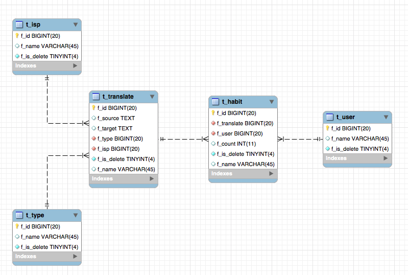

# 微信公众号翻译助手Connor
## 功能
1. 文本自动翻译为中文
2. 图片识别与自动翻译为中文（待补充）
3. 多种翻译提供商接入（待补充）
## 原理
接入微信公众号，得到用户发送的内容，即记录信息后调用对应的翻译api后返回结果
## 数据库

- type:存储翻译的类型
- translate:存储翻译的结果，减少再次调用api的成本
- isp:服务提供商，用于记录服务提供商的名字，用于记录返回
- user:用户表，记录用户的openid，区分每个用户
- habit:用户习惯表，对每个用户的每次翻译结果进行计数，用于未来用户画像
## 技术栈
- JDK8
- SpringBoot2: 快速配置，一建部署
- SpringAOP: 对Controller进行全局拦截，自动处理返回结果和自动处理报错
- SpringMVC
- Mybatis: 使用MyBatis Generator逆向工程自动实现Model和Mapper
- JacksonXML: 自动对XML与JDBC对象互相转化

## 特点
- 对于数据传输皆有对应的Dto,To对象，容易观察出api的数据结构。
- 使用HTTP状态码作为接口标准，详情可看Controller AOP
- 自定义Exception类，对于已知的无意义报错不进行记录，只记录未知异常，并在接口返回处隐藏细节

## 遇到问题
1. 微信订阅号个人账号只支持发送文本，然后回复。不支持消息推送，未来考虑使用微信机器人(普通账号)代替
2. 微信传输接口为XML格式，搜了几十页的Google，最后通过阅读JacksonXML的api找出了自动转换XML的办法
3. 目前使用接口仅有腾讯云api
4. 腾讯云api不支出java9+，spring boot2不支持java7-,所以只能用java8运行
5. 由于mybatis generator生产的文件不带@Mapper声明，执行mvn clean package需要屏蔽pom.xml内的配置

## 运行
1. 保证运行环境为java8
1. 将resource/config下的.example配置文件修改为自己所使用的配置
2  导入数据库sql文件
4. 运行